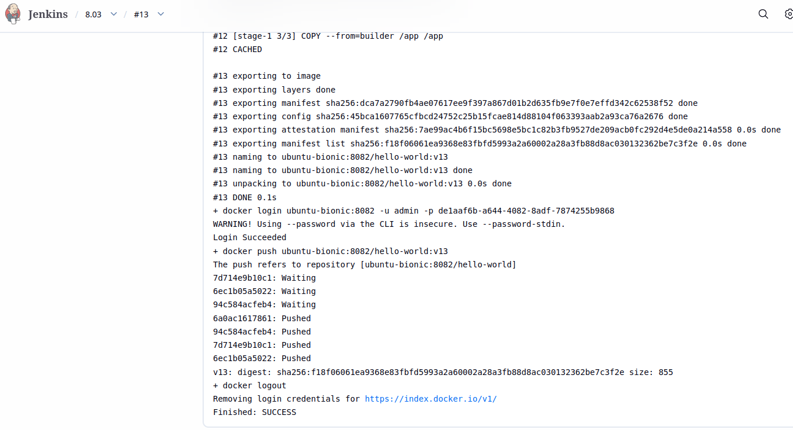
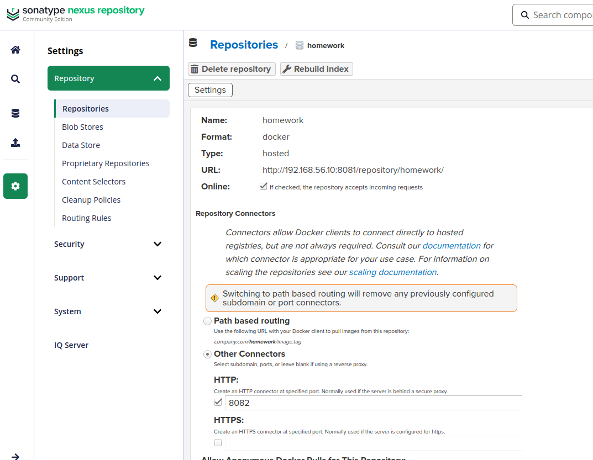
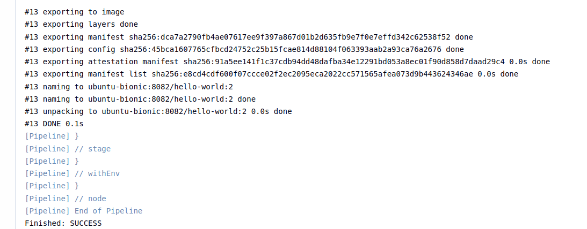
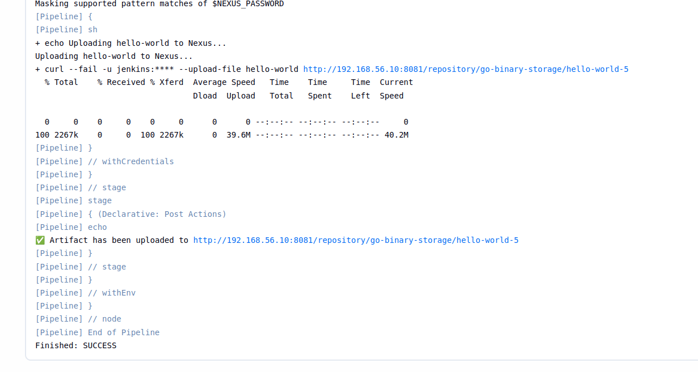
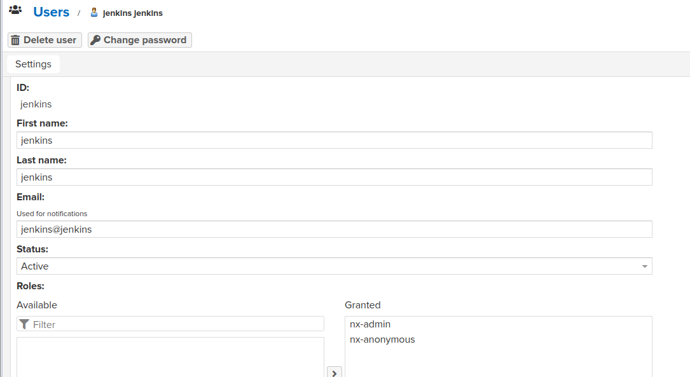
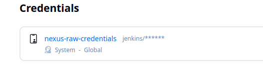

# Домашнее задание к занятию "Что такое DevOps. CI/CD" - Филиппов Константин

## Задание 1
*Приведите ответ в свободной форме...*

**Решение:**  
(Напишите здесь свой ответ. Например, определение CI/CD, зачем нужны, какие инструменты используете и т.д.)

  


---

## Задание 2


  



**Pipeline code:**
```groovy
pipeline {
    agent any
    environment {
        GOROOT = '/usr/lib/go'
        GOPATH = "${env.WORKSPACE}/.go"
    }
    stages {
        stage('Checkout') {
            steps {
                git branch: 'main', 
                    url: 'https://github.com/NekoYo1/sdvps-materials-homework_fork'
            }
        }
        stage('Test') {
            steps {
                sh 'go test ./...'
            }
        }
        stage('Build Docker Image') {
            steps {
                sh "docker build -t ubuntu-bionic:8082/hello-world:${env.BUILD_ID} ."
            }
        }
    }
}

---

## Задание 3


  



pipeline {
    agent any
    environment {
        NEXUS_URL    = 'http://192.168.56.10:8081/repository/go-binary-storage'
        APP_NAME     = 'hello-world'
    }
    stages {
        stage('Checkout') {
            steps {
                git branch: 'main',
                    url: 'https://github.com/NekoYo1/sdvps-materials-homework_fork'
            }
        }
        stage('Test') {
            steps {
                sh 'go test ./...'
            }
        }
        stage('Build Go Binary') {
            steps {
                sh 'CGO_ENABLED=0 GOOS=linux GOARCH=amd64 go build -o ${APP_NAME} .'
            }
        }
        stage('Upload to Nexus') {
            steps {
                withCredentials([usernamePassword(
                    credentialsId: 'nexus-raw-credentials',
                    usernameVariable: 'NEXUS_USER',
                    passwordVariable: 'NEXUS_PASSWORD'
                )]) {
                    sh '''
                        echo "Uploading ${APP_NAME} to Nexus..."
                        curl --fail -u ${NEXUS_USER}:${NEXUS_PASSWORD} \
                             --upload-file ${APP_NAME} \
                             ${NEXUS_URL}/${APP_NAME}-${BUILD_ID}
                    '''
                }
            }
        }
    }
    post {
        success {
            echo "✅ Artifact has been uploaded to ${NEXUS_URL}/${APP_NAME}-${BUILD_ID}"
        }
        failure {
            echo "❌ Build failed. Check the logs."
        }
    }
}
